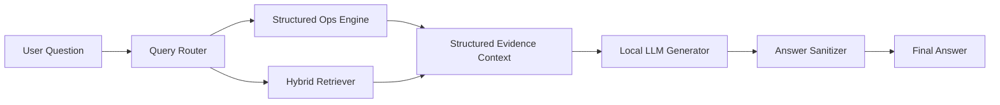

# EV Supply-Chain LLM Comparison Poster Guide (Code-Aligned)

## 1) Poster Title Options
- Structured-First Benchmarking of Local LLMs for EV Supply-Chain QA
- Comparing RAG vs No-RAG Pipelines on Domain-Specific EV Supply-Chain Questions
- Trustworthy Local LLM Evaluation for Structured Industrial QA

## 2) One-Paragraph Problem Statement
This work benchmarks multiple local LLM pipelines on a structured Georgia EV supply-chain knowledge base using 50 human-validated questions. The benchmark compares RAG and no-RAG settings under the same evaluation protocol, with deterministic structured operations for counting, filtering, ranking, and mapping tasks. The goal is to measure practical answer correctness for domain QA workflows, not only generic language quality.

## 3) Data and Task Setup
- Knowledge base: Excel table of EV/automotive supply-chain entities and attributes.
- Questions: 50 human-validated benchmark questions.
- Core question families:
- Aggregation and counting
- Ranking and top-k
- Exhaustive list and filtered list
- OEM-linked supplier mapping
- Ontology-based matching (battery, harness, enclosure, recycling, etc.)
- R&D and location/facility lookups

## 4) System Design You Implemented

### 4.1 RAG Pipeline (Structured-First)
Code references:
- `src/pipelines/rag_pipeline.py`
- `src/query_router.py`
- `src/structured_ops.py`
- `src/retriever.py`
- `src/structured_renderers.py`
- `src/answer_sanitizer.py`

Flow:
1. Route question to a structured query plan (`QueryRouter`).
2. Run deterministic structured operations (`StructuredOpsEngine`).
3. Retrieve support evidence with hybrid retrieval only when needed.
4. Construct context from structured artifacts + retrieved chunks.
5. Generate answer with local model.
6. Sanitize final answer to remove leakage/artifacts.

Important design point:
- For structured question types, structured evidence is primary and retrieval is support.

### 4.2 No-RAG Baseline
Code references:
- `src/pipelines/norag_pipeline.py`
- `src/prompts.py`

Flow:
1. Closed-book prompt with best-effort reasoning.
2. No retrieval, no structured context injection.
3. Same output sanitization step.

Purpose:
- Baseline for comparison against structured-first RAG.

### 4.3 Hybrid Retrieval Method
Code reference:
- `src/retriever.py`

Method:
- Dense retrieval + lexical retrieval.
- Reciprocal Rank Fusion (RRF).
- Cross-encoder reranking.
- Route-aware metadata filtering and fallback behavior.

## 5) Prompting and Output Control
Code reference:
- `src/prompts.py`

RAG prompt behavior:
- Use only provided context.
- Prioritize precomputed structured summaries for totals/rankings/lists.
- Avoid broadening beyond asked scope.

No-RAG prompt behavior:
- Best-effort closed-book response.
- Avoid fabricated exact claims when uncertain.

Answer sanitizer:
- Removes prompt echoes, instruction leakage, code fences, and malformed JSON artifacts.
- Code reference: `src/answer_sanitizer.py`

## 6) Evaluation Metrics

### 6.1 Direct Answer Correctness (Primary)
Code reference:
- `src/evaluation/accuracy_runner.py`

Judge:
- Local Ollama judge (`llama3.1:8b`)
- JSON-only scoring response.

Per-row output:
- `answer_correctness_score` in [0, 1]
- `label` derived from score:
- `correct` if score >= 0.85
- `partially_correct` if 0.40 <= score < 0.85
- `incorrect` if score < 0.40
- `reason`

Aggregate metric:
- Mean Answer Correctness Score across evaluated rows.

### 6.2 RAGAS (Secondary / Optional)
Configured but separate from primary decision logic in current cycle.
Code/config reference:
- `config/benchmark.yaml` (evaluation section)

## 7) 12-Model Final Results (Current Packaged Set)
Source:
- `outputs/final_12_models_results_20260406_184924/all_12_models_aggregate_summary.xlsx`

Ranking by mean answer correctness:
1. `gemma_rag`: 0.798
2. `qwen_rag`: 0.739
3. `mistral_small32_24b_rag`: 0.657
4. `qwen25_32b_rag`: 0.636
5. `gemini_rag`: 0.568
6. `gemma_norag`: 0.477
7. `mistral_small32_24b_norag`: 0.447
8. `qwen25_32b_norag`: 0.335
9. `qwen_norag`: 0.308
10. `qwen35_35b_a3b_norag`: 0.289
11. `gemini_norag`: 0.256
12. `qwen35_35b_a3b_rag`: 0.093

Main outcome:
- RAG variants dominate top ranks except one outlier (`qwen35_35b_a3b_rag`).
- Strongest performer in this packaged run: `gemma_rag`.

## 8) Suggested Poster Figures

### Figure A: Architecture Flow Diagram
Use this Mermaid block:

### Figure B: Model Comparison Bar Chart
- X-axis: 12 pipelines
- Y-axis: mean answer correctness score
- Color by mode: RAG vs no-RAG

### Figure C: RAG vs No-RAG Delta by Model Family
- Bars of `(RAG score - no-RAG score)` for families:
- qwen
- gemma
- gemini
- qwen25_32b
- qwen35_35b_a3b
- mistral_small32_24b

### Figure D: Label Composition Stacked Bars
- Per pipeline stacked proportions:
- correct
- partially_correct
- incorrect

### Figure E: Pipeline Block Diagram (Methods panel)
- Show deterministic path:
- routing -> structured ops -> optional retrieval -> generation -> sanitizer -> evaluator

## 9) Recommended Poster Section Layout
- Left column:
- Motivation and research question
- Data description and benchmark tasks
- Middle column:
- Methodology and architecture
- Hybrid retrieval + structured-first design
- Right column:
- Results (bar charts + table)
- Error patterns and takeaways
- Conclusion and future work

## 10) What to Highlight as Contributions
- Local-first reproducible benchmark setup.
- Structured-first routing and deterministic operations for enterprise QA tasks.
- Continuous correctness scoring against human-validated gold answers.
- Direct comparison of RAG vs no-RAG across multiple model families.

## 11) Limitations You Should Mention
- Local-LLM judge can introduce evaluator bias.
- Results are tied to this KB schema and question set distribution.
- Prompt and routing choices affect pipeline behavior, not just raw model capability.

## 12) Strong Conclusion Template for Poster
Our results show that structured-first RAG pipelines substantially improve domain QA reliability over no-RAG baselines in this EV supply-chain benchmark. Under the current configuration, `gemma_rag` is the top-performing model on mean answer correctness, with `qwen_rag` as a strong runner-up. This supports using deterministic structured evidence + hybrid retrieval as a practical design for industrial QA systems.

## 13) Exact Artifact Paths to Cite in Poster
- Final 12-model package:
- `outputs/final_12_models_results_20260406_184924`
- Single-sheet all-model correctness:
- `outputs/final_12_models_results_20260406_184924/all_12_models_answer_correctness_single_sheet.xlsx`
- Aggregate summary:
- `outputs/final_12_models_results_20260406_184924/all_12_models_aggregate_summary.xlsx`
- Full metadata manifest:
- `outputs/final_12_models_results_20260406_184924/manifest.json`
